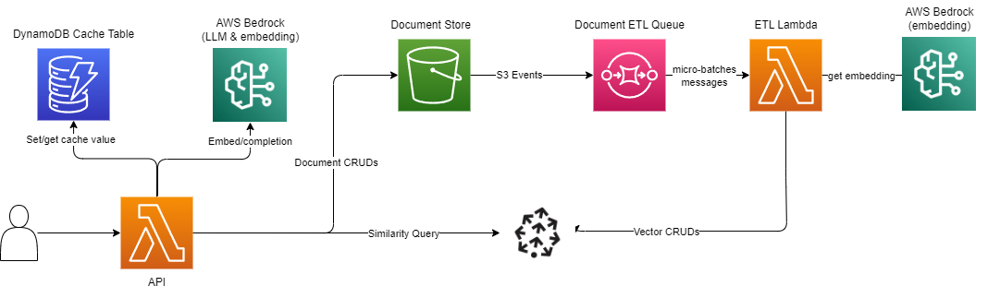

# SchoolAI RAG coding challenge

## Objective
Develop a simple question-answering system using a Retrieval-Augmented Generation (RAG) framework. The system should embed documents from a public dataset, retrieve relevant information based on a user query, and generate an appropriate response.

## Getting Started

[API Endpoint to interact with the system](https://baegno7hpbbyub7fcfzrgkvvsu0lsqhx.lambda-url.us-east-1.on.aws/docs#/)

### Repo Structure:
- `api/api/`: contains the API code for the system
  - `routers/`: contains the FastAPI routers for the system
  - `services/`: contains the services for the system
    - `retrieval.py`: contains the retrieval logic for the system
    - `chat.py`: contains the chat logic for the system
    - `cache.py`: contains the cache logic for the system
- `indexer/indexer/`: contains the ETL code for the system
  - `services/`: contains the services for the system
    - `extract.py`: contains the extraction logic for the system
    - `transform.py`: contains the transformation logic for the system including data cleaning and embedding
    - `load.py`: contains the loading logic for the system to load the embeddings into Pinecone and mark the document as indexed in S3
  - `iac/iac/`: contains the CDK code for the system
    - `stack.py`: contains the CDK stack for the system

### Deploying the application:

**Prerequisites:**
- configure aws profile as `school-ai` following [aws docs](https://docs.aws.amazon.com/cli/latest/userguide/cli-configure-sso.html#cli-configure-sso-configure) 

**Dev Container (Recommended):**
1. install the dev container CLI: `npm install -g @devcontainers/cli`
2. create a shell in the container: `devcontainer exec --workspace-folder . /bin/zsh`
3. create a poetry shell: `poetry shell`
4. deploy the stack: `projen cdk-deploy`
    - currently broken because of an issue with the Pinecone DB Bundling when deploying. 🥲 Please use the *Local Development* steps

**Local Deployment:**
1. Install poetry: `curl -sSL https://install.python-poetry.org | python3 -`
2. Synth the project: `projen`
3. Deploy the stack: `projen cdk-deploy`

## Approach
**NOTE:** I haven't built a deployed RAG system in a hot sec, and wanted to speed run an application from scratch. I was expecting it to take about 4-5 hours, but took about 7 instead. A bit longer than expected, but this was a blast to build. Thanks for making a fun challenge!

I'm a huge fan of rapid development and rapid deployment of systems, so I thought this would be a fun challenge to create fully deploy this system to AWS using CDK so that anyone could interact with it. I wanted the ability for anyone to add and delete documents dynamically and be able to query the system.

To iterate quickly, I chose a fully serverless stack on AWS with the following services:
- S3 for storing documents
- Lambda for the API and ETL to index documents
- SQS for the queue to process the documents
- DynamoDB for caching chat responses
- Serverless Pinecone for the embeddings
- Bedrock for embeddings and LLM
  - If time permitted, I would have quickly deployed a sageMaker endpoint for the inference, but scope (self-inflicted) was already on the larger side for the time allotted

**Architecture:**

**System Features:**
- **Add Document:** Add a documents from the [SciQ dataset](https://allenai.org/data/sciq) to the system
  - Queueing system can handle any number of batches of documents in parallel
  - Locks documents to prevent pre-mature deletion when the system is indexing a document
- **Delete Document:** Delete a document from the system
  - Deletes documents from pinecone index and s3
  - Prevents deletion of documents that are currently being indexed
- **Get and List Documents:** Get a document by ID or list all documents
- **Document Query:** Query the system with a question and get a list of documents that are relevant to the question
  - uses elbow method to determine the threshold for relevant documents
  - after pulling from pinecone, uses TF-IDF and term overlap for re-ranking
  - manual k parameter override to get more or less documents
  - manual threshold parameter override to get more or less relevant documents
- **Document Chat:** Chat with the system and get responses to questions
  - uses the same query system as above (same features exposed)
  - caches responses in DynamoDB for faster retrieval
  - returns a dot product similarity score for the response as an evaluation metric
- **Infrastructure:** Deployed to AWS using CDK
  - Uses a custom [pinecone db CDK construct](https://pypi.org/project/pinecone-db-construct/) that I built last year for statefully managing pinecone indexes
  - Fully serverless stack with S3, Lambda, SQS, DynamoDB, and Pinecone

## Challenges
To be honest, most of this was pretty run of the mill as far as a RAG framework goes. The biggest challenge that was encountered (self-inflicted because of deploying to AWS), was parsing S3 bucket messages. This wasn't a huge issue, but did consume a good 30min of debugging time.

## Improvements
- **Indexing Improvements:**
  - Implement a chunking system to process larger documents
  - Implement hybrid search (spares/dense) indexing using [SPLADE](https://github.com/naver/splade)
  - Experiment with different embedding models to evaluate performance
- **ETL Improvements:**
  - Handle any documents, not just the SciQ dataset
  - Better failure handling and a DLQ
  - Implement a more robust locking system for documents using FIFO process for indexing
  - Cache embeddings to eliminate expensive re-embedding when documents are quickly deleted and re-added to the system
- **Document Storage:**
  - Utilize DynamoDB for storing docs, and s3 for cold, append only storage
- **Query Improvements:**
  - Experimentally determine the best k and threshold parameters for the elbow method
  - Implement a more robust re-ranking system for the query system/evaluate it's performance
